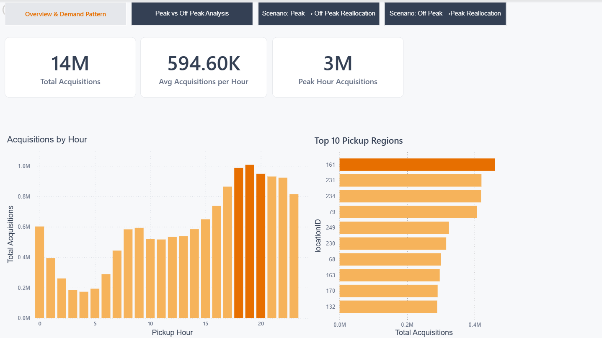
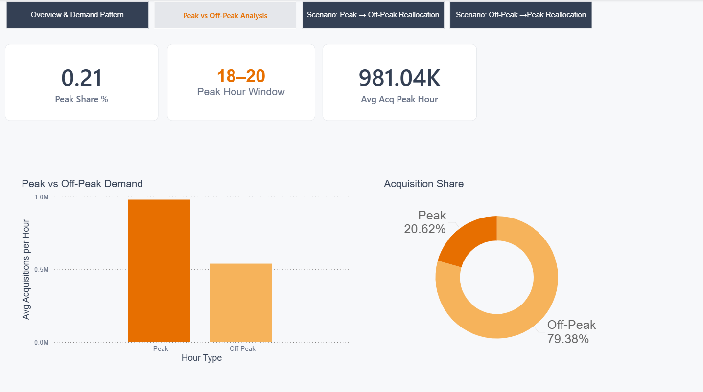
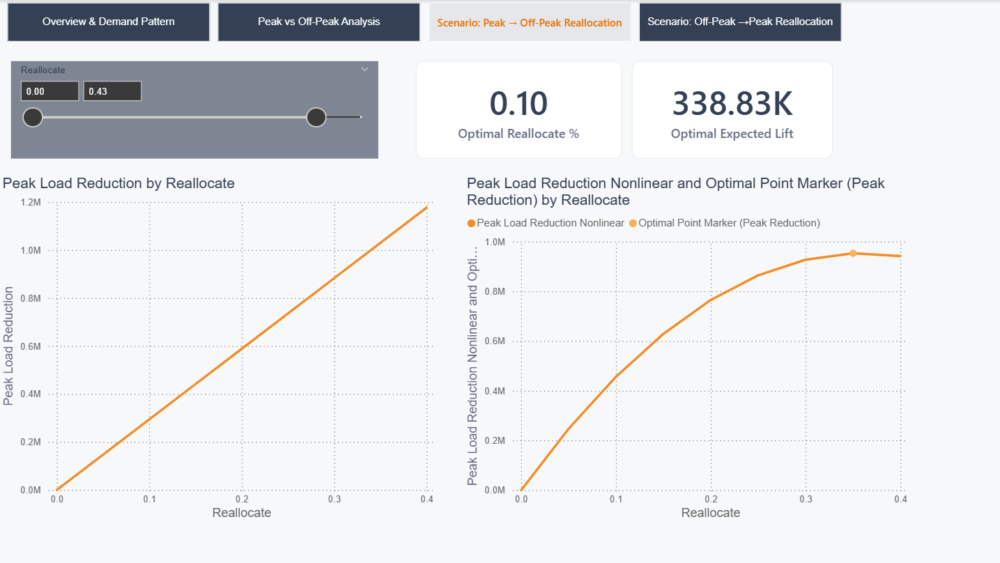
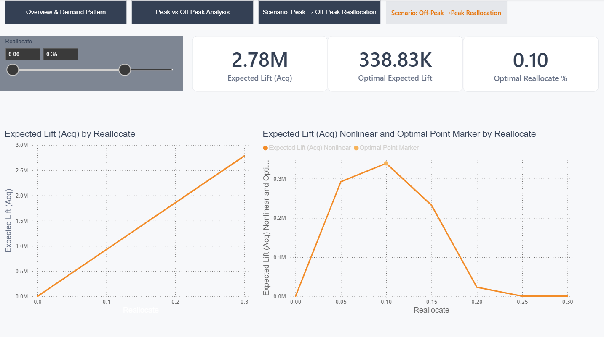

# Uber Power BI Analytics Dashboard

## Project Overview

An interactive Power BI dashboard analyzing Uber trip demand patterns, peak-hour behavior, and resource allocation scenarios.

The project focuses on transforming raw trip data into actionable business insights for operational decision-making.

---

## Tools & Technologies

- Power BI
- DAX
- Data Modeling
- Data Visualization
- Business Intelligence Analytics

---

## Dashboard Pages

### 1. Overview & Demand Pattern

Provides an executive overview of:
- Total acquisitions
- Hourly demand distribution
- Peak demand periods
- Top pickup regions

---

### 2. Peak vs Off-Peak Analysis

Analyzes differences between peak and off-peak periods.

Key metrics:
- Peak share
- Peak hour window
- Average acquisitions

---

### 3. Resource Reallocation Scenarios

Simulation of operational scenarios to estimate demand impact.

---

### 4. Expected Lift Analysis

Evaluates potential acquisition improvement under different allocation strategies.

---

## Key Insights

- Peak demand occurs mainly between 18:00–20:00.
- Peak hours represent approximately 20.62% of total acquisitions.
- Scenario analysis identifies optimal resource reallocation points.
- Interactive analysis enables data-driven operational decisions.

---

## Files

- Power BI dashboard (.pbix)
- Dashboard screenshots
- Documentation
- 
---

## Dashboard Demo

An interactive walkthrough of the Uber Power BI Analytics Dashboard, demonstrating navigation between report pages, KPI analysis, and scenario-based insights.

🎥 [Watch Uber Power BI Dashboard Demo](Uber_PowerBI_Dashboard_Demo.mp4)
